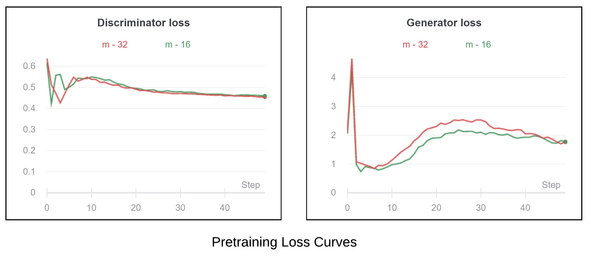
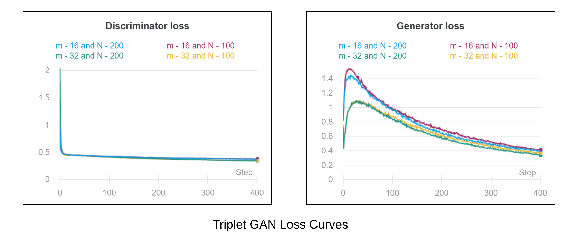
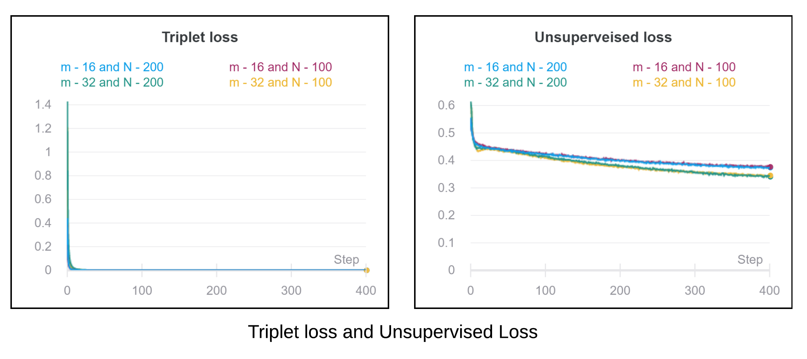
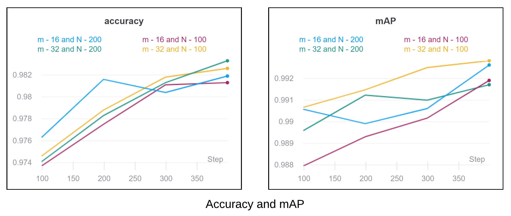
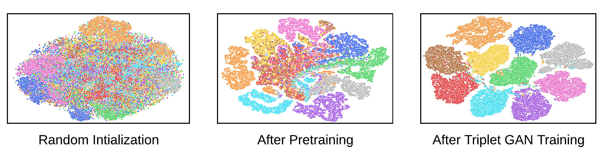
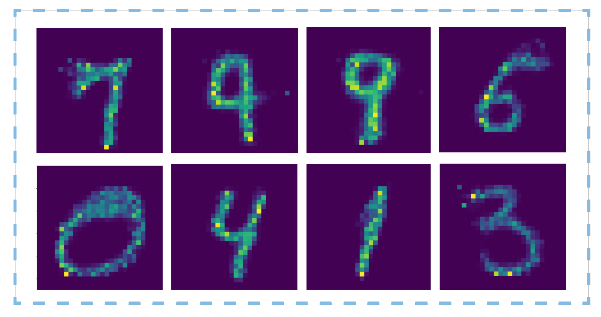
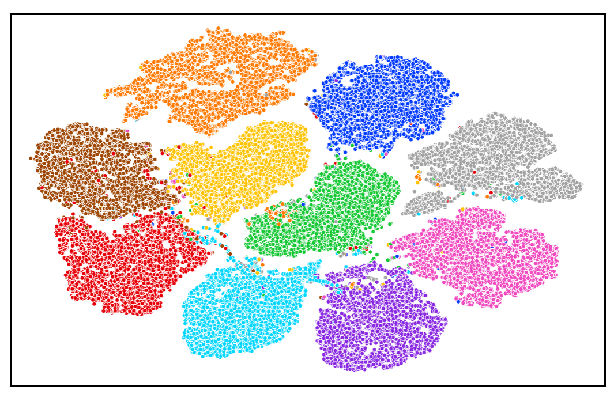

# Triplet GAN

This is the code  for *Training Triplet Networks with GAN* ([arXiv](https://arxiv.org/abs/1704.02227)).

The code is based on *Improved Techniques with GAN* ([arXiv](https://arxiv.org/abs/1606.03498)) ([code](https://github.com/Sleepychord/ImprovedGAN-pytorch))

Official Code Repo - [Github](https://github.com/maciejzieba/tripletGAN)


## Installation

Use the package manager [pip](https://pip.pypa.io/en/stable/) to install all required libraries.


```bash
pip install requirements.txt 
```

or

```bash

conda create --name <env> --file requirements.txt 
```


## Pretraining
For pretraining the Triplet GAN we have used *Improved Techniques with GAN* for without the triplet loss function.

For Pretraining for MNIST data use `pretrain.py --config_file configs/pretrain_gan.yml`
Results of pretraining are shown in Figure - 

## Training Triplet GAN

For training the triplet GAN after *pretraining* use `main.py --config_file configs/triplet_gan.yaml`


## Results

### Pretraining





### Triplet Traininig





### Accuracy and mAP

<center>


<table style="border-collapse:collapse;border-spacing:0" class="tg"><thead><tr><th style="border-color:inherit;border-style:solid;border-width:1px;font-family:Arial, sans-serif;font-size:14px;font-weight:normal;overflow:hidden;padding:10px 5px;text-align:center;vertical-align:top;word-break:normal"></th><th style="border-color:inherit;border-style:solid;border-width:1px;font-family:Arial, sans-serif;font-size:14px;font-weight:normal;overflow:hidden;padding:10px 5px;text-align:center;vertical-align:top;word-break:normal" colspan="2">m = 16</th><th style="border-color:inherit;border-style:solid;border-width:1px;font-family:Arial, sans-serif;font-size:14px;font-weight:normal;overflow:hidden;padding:10px 5px;text-align:center;vertical-align:top;word-break:normal" colspan="2">m = 32</th></tr></thead><tbody><tr><td style="border-color:inherit;border-style:solid;border-width:1px;font-family:Arial, sans-serif;font-size:14px;overflow:hidden;padding:10px 5px;text-align:center;vertical-align:top;word-break:normal"></td><td style="border-color:inherit;border-style:solid;border-width:1px;font-family:Arial, sans-serif;font-size:14px;overflow:hidden;padding:10px 5px;text-align:center;vertical-align:top;word-break:normal">N = 100</td><td style="border-color:inherit;border-style:solid;border-width:1px;font-family:Arial, sans-serif;font-size:14px;overflow:hidden;padding:10px 5px;text-align:center;vertical-align:top;word-break:normal">N = 200</td><td style="border-color:inherit;border-style:solid;border-width:1px;font-family:Arial, sans-serif;font-size:14px;overflow:hidden;padding:10px 5px;text-align:center;vertical-align:top;word-break:normal"><span style="font-weight:400;font-style:normal">N = 100</span></td><td style="border-color:inherit;border-style:solid;border-width:1px;font-family:Arial, sans-serif;font-size:14px;overflow:hidden;padding:10px 5px;text-align:center;vertical-align:top;word-break:normal"><span style="font-weight:400;font-style:normal">N = 200</span></td></tr><tr><td style="border-color:inherit;border-style:solid;border-width:1px;font-family:Arial, sans-serif;font-size:14px;overflow:hidden;padding:10px 5px;text-align:center;vertical-align:top;word-break:normal">Accuracy</td><td style="border-color:inherit;border-style:solid;border-width:1px;font-family:Arial, sans-serif;font-size:14px;overflow:hidden;padding:10px 5px;text-align:center;vertical-align:top;word-break:normal">0.9813</td><td style="border-color:inherit;border-style:solid;border-width:1px;font-family:Arial, sans-serif;font-size:14px;overflow:hidden;padding:10px 5px;text-align:center;vertical-align:top;word-break:normal">0.9819</td><td style="border-color:inherit;border-style:solid;border-width:1px;font-family:Arial, sans-serif;font-size:14px;overflow:hidden;padding:10px 5px;text-align:center;vertical-align:top;word-break:normal">0.9826</td><td style="border-color:inherit;border-style:solid;border-width:1px;font-family:Arial, sans-serif;font-size:14px;overflow:hidden;padding:10px 5px;text-align:center;vertical-align:top;word-break:normal">0.9833</td></tr><tr><td style="border-color:inherit;border-style:solid;border-width:1px;font-family:Arial, sans-serif;font-size:14px;overflow:hidden;padding:10px 5px;text-align:center;vertical-align:top;word-break:normal">mAP</td><td style="border-color:inherit;border-style:solid;border-width:1px;font-family:Arial, sans-serif;font-size:14px;overflow:hidden;padding:10px 5px;text-align:center;vertical-align:top;word-break:normal">0.9345</td><td style="border-color:inherit;border-style:solid;border-width:1px;font-family:Arial, sans-serif;font-size:14px;overflow:hidden;padding:10px 5px;text-align:center;vertical-align:top;word-break:normal"><span style="font-weight:400;font-style:normal">0.9501</span></td><td style="border-color:inherit;border-style:solid;border-width:1px;font-family:Arial, sans-serif;font-size:14px;overflow:hidden;padding:10px 5px;text-align:center;vertical-align:top;word-break:normal"><span style="font-weight:400;font-style:normal">0.9330</span></td><td style="border-color:inherit;border-style:solid;border-width:1px;font-family:Arial, sans-serif;font-size:14px;overflow:hidden;padding:10px 5px;text-align:center;vertical-align:top;word-break:normal"><span style="font-weight:400;font-style:normal">0.9473</span></td></tr></tbody></table>
</center>





### Tsne Plots



### Generator Output



<!-- ## Results


<table>
  <tr>
    <th></th>
    <th>Validation IOU</th>
    <th>Validation Loss</th>
  </tr>
  <tr>
    <td>Upsample</td>
    <td>0.752</td>
    <td>0.144</td>
  </tr>
  <tr>
    <td>Convtrans2d</td>
    <td>0.783</td>
    <td>0.134</td>
  </tr>
  <tr>
    <td>Skip Connections</td>
    <td>0.743</td>
    <td>0.149</td>
  </tr>
</table>

### Training IOU Plot


### Validation IOU Plot


### Training Error Plot


 -->


<!-- ### Validation Error Plot

 -->


## Contributing
Pull requests are welcome. For major changes, please open an issue first to discuss what you would like to change.


